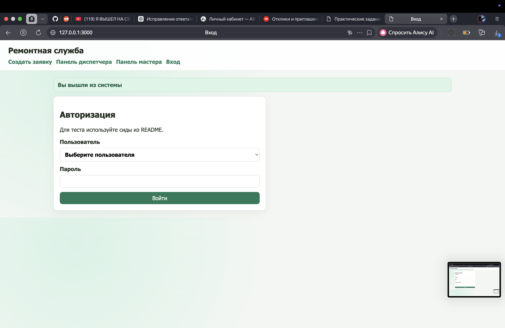
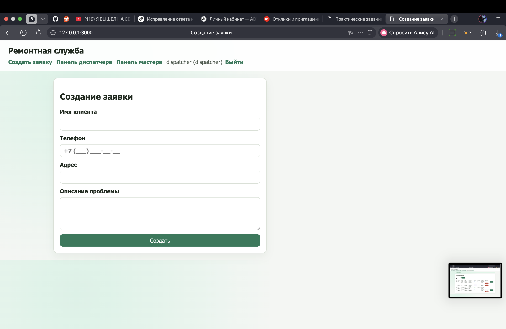

## Скриншоты

### 1) Создание заявки


### 2) Авторизация


### 3) Панель диспетчера


# Repair Service App

Небольшое веб-приложение для приёма и обработки заявок в ремонтную службу.

Реализованы роли:
- `dispatcher` (диспетчер)
- `master` (мастер)

## Функционал

- Создание заявки (`clientName`, `phone`, `address`, `problemText`) со статусом `new`
- Панель диспетчера:
  - список заявок
  - фильтр по статусу
  - назначение мастера (`new -> assigned`)
  - отмена заявки (`new/assigned/in_progress -> canceled`)
- Панель мастера:
  - список заявок, назначенных текущему мастеру
  - взять в работу (`assigned -> in_progress`)
  - завершить (`in_progress -> done`)
- Безопасная обработка гонки при `take`:
  - атомарный SQL-переход по условию статуса
  - при параллельных запросах один получает `200`, второй `409`

## Технологии

- Node.js 22
- Встроенный модуль `node:sqlite` (SQLite)
- HTTP server на стандартной библиотеке Node.js
- Docker Compose
- Автотесты на `node:test`

## Структура

- `src/` — сервер, роутинг, бизнес-логика
- `migrations/` — SQL-миграции
- `seeds/` — SQL-сиды
- `scripts/` — утилиты БД и `race_test.sh`
- `tests/` — автотесты

## Запуск (вариант A, Docker Compose)

```bash
docker compose up --build
```

После старта приложение доступно по адресу:
- http://localhost:3000

## Запуск (вариант B, без Docker)

Требуется Node.js 22+.

```bash
npm run db:init
npm start
```

Приложение будет доступно по адресу:
- http://127.0.0.1:3000

## Тестовые пользователи (из сидов)

- Диспетчер:
  - `name`: `dispatcher`
  - `password`: `dispatcher123`
- Мастер 1:
  - `name`: `master_ivan`
  - `password`: `master123`
- Мастер 2:
  - `name`: `master_petr`
  - `password`: `master123`

## Миграции и сиды

```bash
npm run db:migrate
npm run db:seed
```

Инициализация одним шагом:

```bash
npm run db:init
```

## Автотесты

```bash
npm test
```

Покрыты минимум 2 сценария:
- создание заявки
- race-safe поведение при параллельном `take`

## Проверка гонки (по ТЗ)

### Вариант 1: готовый скрипт

При запущенном приложении:

```bash
bash scripts/race_test.sh
```

Ожидаемый результат: один ответ `HTTP 200`, второй `HTTP 409`.

### Вариант 2: два терминала с curl

1. Создайте заявку:

```bash
curl -sS -X POST http://localhost:3000/api/requests \
  -H 'Content-Type: application/json' \
  -d '{"clientName":"Race","phone":"+7 999 111-11-11","address":"Race st","problemText":"Check"}'
```

2. Авторизуйтесь диспетчером и назначьте мастера (`masterId: 2`) через `/api/dispatcher/requests/:id/assign`.
3. В двух терминалах авторизуйтесь как `master_ivan`.
4. Одновременно выполните:

```bash
curl -i -X POST http://localhost:3000/api/master/requests/<ID>/take -b master_cookie_a.txt
curl -i -X POST http://localhost:3000/api/master/requests/<ID>/take -b master_cookie_b.txt
```

Ожидание: ровно один запрос успешен, второй получает `409 Conflict`.

## Дополнительно

- Есть журнал событий `request_events` (audit log).
- Есть UI-страницы:
  - `/requests/new`
  - `/dispatcher`
  - `/master`
- Для скриншотов под сдачу добавлена папка `screenshots/` (можно сохранить 3 экрана туда).
